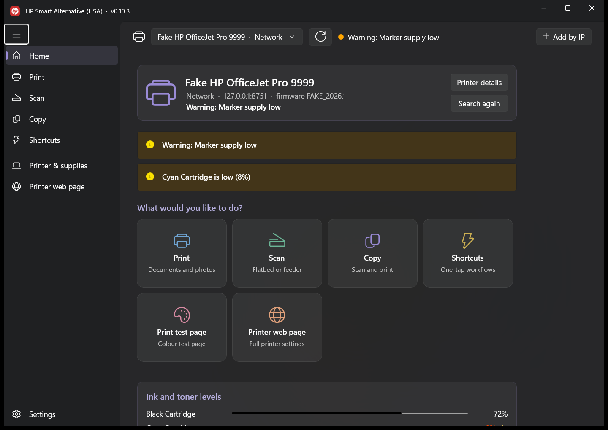
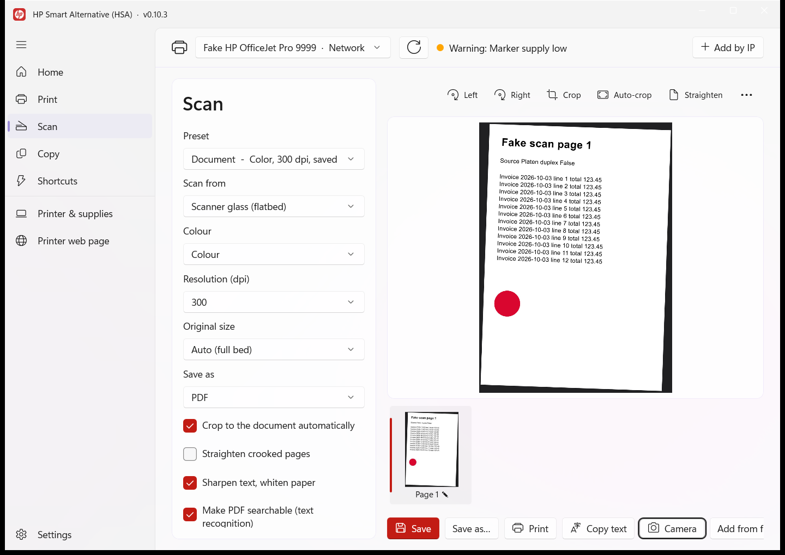

# HP Smart Alternative (HSA)

[](https://github.com/othniel-Anthony/HP-Smart-Alternative-HSA/releases/latest)
[](LICENSE)

HSA is a Windows app for the everyday things you do with a printer: print, scan, copy, check the ink, and open the printer's own settings page. It does what HP Smart does for those jobs, but it doesn't need an HP account, and it isn't limited to HP printers. It talks to the printer directly, so most printers made in the last decade or so work, and so does anything that has a normal Windows driver.

It's a single `.exe`. There's nothing to install unless you want a Start menu entry.



> The screenshots in this README were taken against a simulated printer, which is why it's called "Fake HP OfficeJet Pro 9999".

## Download

Grab `HSA-<version>-win-x64.exe` from the [latest release](https://github.com/othniel-Anthony/HP-Smart-Alternative-HSA/releases/latest) and double-click it. That's it.

- **Windows 10 (1809 or newer) or Windows 11.** You don't need .NET or anything else installed; it's all inside the file.
- **The first start takes a few seconds** while the app unpacks itself. After that it opens quickly.
- **Windows will probably stop you the first time.** You will see a *Windows protected your PC* box (or an "are you sure you want to run this?" prompt) saying the publisher is unknown. The exe isn't code-signed yet, because that takes a paid certificate or approval for a free open-source one. Click *More info*, then *Run anyway*. To stop it asking, right-click the exe, choose *Properties* and tick **Unblock**, or install with the script described below. Each release lists a SHA-256 checksum so you can check the download. [More about this](docs/code-signing.md).
- **Windows Firewall may ask about network access** the first time. Allow it on private networks; that's how the app finds printers on your Wi-Fi.
- If you'd rather have a Start menu shortcut and an entry in *Apps & features*, the `.zip` in the release has a small per-user installer script (`Install-HSA.ps1`). It doesn't need admin rights, and it clears Windows' "downloaded from the internet" mark on the installed copy so the app opens without that box.

## What you can do

**Print.** Drop in PDFs and photos (JPG, PNG, BMP, GIF, TIFF) and set copies, colour or black and white, two-sided, paper size, how the page is fitted, quality, and which pages. You get a preview first. If the printer has a Windows driver, HSA prints through it. If it doesn't, HSA sends the job straight to the printer over IPP, which also works for printers connected by USB.

**Scan.** Scan from the glass or the document feeder, one side or both. There are presets (Document, Black & white, Photo, ID card, Book, Feeder) and you can change anything they set. Scanned pages show up in a strip you can reorder. For each page you can rotate, crop, auto-crop to the document, straighten a crooked page, switch to grayscale or black and white, adjust brightness and contrast, type text onto it, or sign it. Save as PDF, JPEG, PNG or TIFF. If you tick the box, the PDF is searchable. A page that went in sideways is turned upright for the saved PDF. There's also a **Copy text** button that reads the page with Windows' built-in text recognition, and a **Camera** button if you'd rather photograph a document.

**Copy.** Scan and print in one go, with copies, colour, quality, paper and scaling. There's an ID card mode that scans both sides and puts them on one page.

**Shortcuts.** Save a scan or copy with all its settings as a one-click card: "Scan receipt", "Copy ID card", whatever you do often. You can have it save to a particular folder, open the result, or print it as well.

**Check on the printer.** See ink or toner levels, the printer's status and any warnings, and the jobs waiting on it (you can cancel them). **Print test page** on the home screen prints a colour test page, and there's a separate diagnostic page with colour patches, gradients and a nozzle grid for chasing print-quality problems. **Find this printer** makes it flash or beep. **Copy support report** puts the details you'd want in a bug report on the clipboard.

**The printer's own web page.** Almost every network printer has a settings page served by the printer itself. HSA shows it inside the app. Many HP printers also serve it over their USB cable, and HSA can open that too (see below).



## What isn't here

HP Smart has a few features that depend on HP's online services, and those can't be reproduced by an independent app: HP+ and Instant Ink sign-up, printing from anywhere over the internet, Mobile Fax, and saving scans to HP's cloud. Cleaning the print head and aligning cartridges are also left out, because each manufacturer does them differently; HSA opens the printer's driver settings and web page, where those options live, instead of guessing at commands.

## Honest status

It hasn't been tried on a wide range of real printers yet, so here is what has and hasn't been checked.

**Checked with automated tests during development** (unit tests plus tests that drove the real app; they are not included in this repository):
- Finding printers on the network, adding one by IP address, reading ink levels and status.
- Printing through a real Windows driver (the "Microsoft Print to PDF" printer), and printing straight to a printer over IPP, including every option.
- Scanning from the glass, the feeder and both sides, against a simulated scanner, with the "busy, try again" behaviour real scanners show.
- Editing, text recognition, searchable PDFs, copy, shortcuts, settings, the installer.

**Not yet tried on the real thing:**
- Opening a printer's web page over a USB cable with a real HP printer. The code that does it was checked against a simulated device, but it hasn't been proven on a real printer yet.
- Scanning through the Windows scanner driver (the fallback for older scanners).
- Putting ink on paper with a physical printer.
- Taking a photo with the camera button, and drawing a signature (the signature box opens, but it was only tested without drawing).

If something doesn't work with your printer, please [open an issue](https://github.com/othniel-Anthony/HP-Smart-Alternative-HSA/issues) and paste in the support report (*Printer & supplies → Copy support report*). It's the quickest way to see what your printer is doing.

## Printer web page over USB

Lots of HP printers expose their settings page, and the same print/scan services a network printer has, through a special interface on the USB cable. HSA finds those interfaces, talks to the one that Windows has attached to the generic `WinUSB` driver, and opens a private local address (something like `http://127.0.0.1:52810/`) that only your PC can see. The web page, the ink levels and scanning then work the same as they would over Wi-Fi.

A few things to know:
- Settings → *USB printer connections* shows what Windows reports for each interface and whether HSA can open it.
- HSA doesn't install or replace any drivers. Printing and WIA scanning keep using the normal ones.
- Only one program can use that interface at a time, so close HP Smart first if it's running.

## Troubleshooting

**My printer isn't listed.** Give it a moment and press the refresh button at the top. If it's on your network but still missing, use **Add by IP** and enter its address (you can add a port, like `192.168.1.50:8080`). Your router's device list or the printer's network page will show the address.

**It finds the printer but can't scan.** Some older printers don't offer network scanning. If Windows can scan with it, HSA will use that route, so make sure the printer's scanner driver is installed.

**"Copy text" says no language is installed.** Windows needs an OCR language pack. Open Settings → Time & language → Language & region, and make sure your language has *Optical character recognition* installed.

**Where does it keep things?** Settings are in `%LOCALAPPDATA%\HP Smart Alternative` and scans go to `Documents\HSA Scans` unless you pick another folder in Settings.

## Building it yourself

You need Windows and the [.NET 8 SDK](https://dotnet.microsoft.com/download). You don't need Visual Studio.

```powershell
dotnet build src/PrintHub.App -p:Platform=x64      # build the app
.\build.ps1                                        # the single-file exe + zip, into dist\
```

The app also takes a few command-line options: `--page home|print|scan|copy|shortcuts|printer|web|settings` opens a particular screen, `--import <image>` opens an image in the scan editor, and `--print <file>` queues a file on the Print screen.

### How it's organised

```
src/PrintHub.Core     finding printers, IPP, eSCL, Windows scanner (WIA), USB, imaging, PDF, text recognition, printing
src/PrintHub.App      the WinUI 3 app
src/PrintHub.Probe    a small command-line tool for poking at a printer
installer/            the optional per-user install and uninstall scripts
```

The code projects are still called `PrintHub.*` from when the project had a different working name.

## An earlier version

HSA started life as a different, WPF-based tool for managing HP drivers and printer settings (versions 0.1 to 0.2.15). This is a from-scratch rewrite with a different approach, built around talking to printers directly and covering print, scan and copy. The old source is kept on the [`legacy-wpf`](https://github.com/othniel-Anthony/HP-Smart-Alternative-HSA/tree/legacy-wpf) branch, and the old releases are still on the Releases page.

## Licence and disclaimers

MIT. See [LICENSE](LICENSE).

This is an independent project. It isn't made by, affiliated with or endorsed by HP Inc. "HP", the HP logo and "HP Smart" are trademarks of HP Inc. The app icon is based on the HP logo and is here for personal use; if you fork or redistribute this, swap in your own artwork (`src/PrintHub.App/Assets`).

Made by Othniel Anthony / Circuit & Ink.
